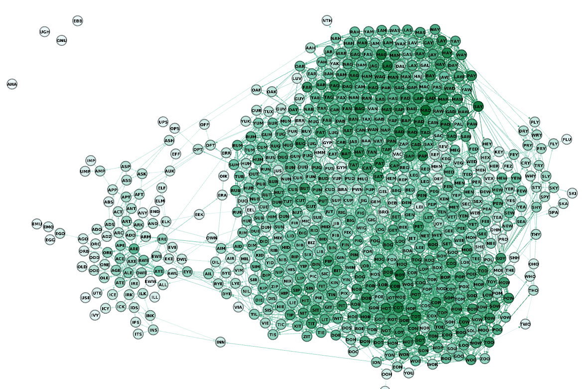
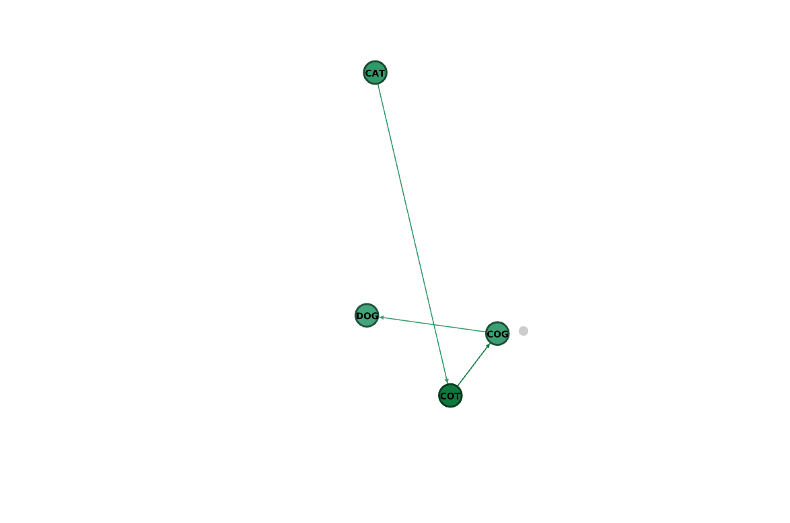

# LetterGame

**Número da Lista**: Grafos 1<br>
**Conteúdo da Disciplina**: Grafos (DFS & BFS)<br>

## Alunos

| Matrícula  | Aluno                          |
| ---------- | ------------------------------ |
| 19/0115564 | Pedro Lucas Siqueira Fernandes |
| 19/0030755 | João Paulo Lima da Silva       |

## Sobre

O objetivo do projeto **LetterGame** é construir uma ferramenta para manipulação e análise de grafos de palavras, onde cada palavra é representada como um nó e cada aresta representa uma conexão entre duas palavras que diferem por apenas uma letra. Esse tipo de grafo é útil para estudar relações linguísticas, resolver quebra-cabeças de palavras e analisar cadeias de transformações lexicais.

### Como Funciona
1. **Carregamento do Dicionário**:
   - O projeto carrega uma lista de palavras de um arquivo (`12dicts_words.txt`) e filtra palavras com um comprimento específico (ex.: três letras).
   
2. **Criação de uma Lista de Adjacência**:
   - Cada par de palavras é comparado para verificar se diferem por apenas uma letra. Se sim, uma aresta é criada entre essas palavras na lista de adjacência.

3. **Busca em Largura (BFS) para Encontrar Caminhos**:
   - Usando BFS, o projeto encontra o caminho mais curto entre duas palavras. Esse processo permite verificar a sequência de transformações necessária para mudar uma palavra em outra.

4. **Geração e Exportação do Grafo**:
   - O grafo gerado é exportado em formato GEXF, o que permite visualizá-lo em ferramentas como o Gephi para análises e visualizações avançadas.

## Screenshots

Adicione 3 ou mais screenshots do projeto em funcionamento, como:
1. Exibição de execução do script: 

2. Visualização do grafo no Gephi com o arquivo GEXF gerado 

3. Caminho encontrado pelo BFS entre duas palavras

4. Visualização do caminho encontrado pelo BFS no Gephi

## Instalação

**Linguagem**: Javascript<br>
**Framework**: (caso exista)<br>
Descreva os pré-requisitos para rodar o seu projeto e os comandos necessários.

## Uso

Para usar o projeto, execute o script principal no Node.js.

### Passo a Passoa
1. **Execução do Script Principal**:
   ```bash
   node letterGame.js
   ```
   - O script carregará o dicionário, criará a lista de adjacência e exibirá o caminho entre duas palavras no console.

2. **Exportação do Grafo**:
   - O grafo será salvo em um arquivo GEXF (`graph.gexf`) para visualização no Gephi ou outra ferramenta compatível.

3. **Visualização do Grafo no Gephi** (opcional):
   - Abra o arquivo `graph.gexf` no Gephi para explorar o grafo de palavras.
   - **Baixe e instale o Gephi**
   - Abra o Gephi e carregue o arquivo DOT `graph.dot`.
   - Na aba de layout, selecione **ForceAtlas 2**.
   - Nas configurações do ForceAtlas 2:
   - Ative a opção **Stronger Gravity**
   - Defina o valor de **Gravity** para 0.02
   - Pressione **Run** para iniciar a formação do grafo.
   - Quando o grafo estiver quase estabilizado, ative a opção **Prevent Overlap** para evitar sobreposição.
   - Pressione **Stop** para finalizar as alterações de layout.
   - Em **Appearance**:
   - Na seção **Ranking**, escolha **Degree** e selecione uma paleta de cores.
   - Em seguida, pressione **Apply** para aplicar as cores.
   - Na janela **Graph**, pressione o ícone que se parece com um **T** para mostrar os rótulos dos nós (**Node Labels**).
   - Ajuste o tamanho dos rótulos com o controle deslizante até que eles se encaixem nos nós.
   - Ajuste a cor dos rótulos para que contrastem bem com as cores dos nós.

## Outros

Quaisquer outras informações sobre seu projeto podem ser descritas abaixo.
